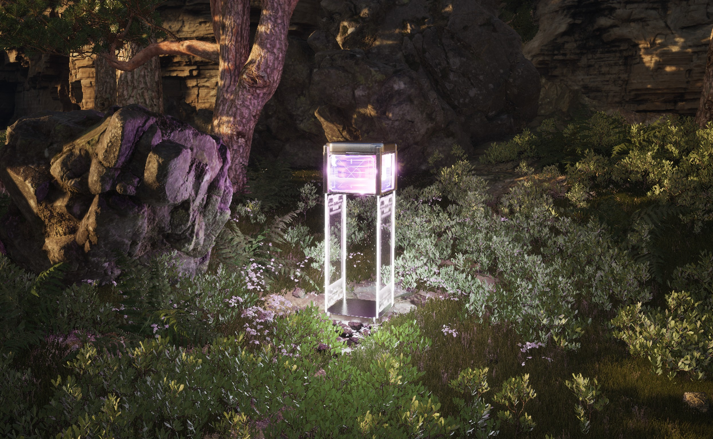

# GD1_Playground_2425

3D temps réel. 

⚠️ Suite aux problèmes de bande passante avec Github, nous utiliserons désormais [gitlab](https://gitlab.com/jniac/gd1_playground_2425).

Pour changer les réglages `git`, dans le terminal de VSCode : 
```shell
git remote set-url origin https://gitlab.com/jniac/gd1_playground_2425
```

Unreal Engine.




## Liens
- [briefs](Web/briefs/)
- [évaluation](https://jniac.github.io/GD1_Playground_2425/Web/evaluation/)

