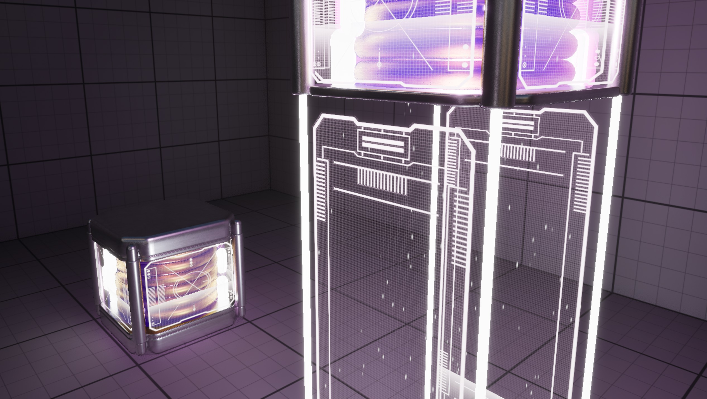

# Checkpoint 

## Demande 

Réaliser un "checkpoint" animé.

Contraintes : 
- Créer des modèles 3D originaux ("static mesh" via "Modeling Mode")
- Créer des matériaux originaux, animés, dont :
  - certains animés
  - certains transparent
  - certains faisant usage de masque
- Créer une animation simple

## Notions abordées :

- Concept généraux
  - ✅ Transform Relative / World

- Matériaux
  - ✅ Opaque / transparent
  - ✅ Animations basées sur le temps
  - ✅ Matériaux dynamiques (parameters)
  - ✅ Utiliser les masques, composer (RGBA, Min, Max, Add, Multiply)

- Modélisation
  - ✅ Modélisation basique (translation, extrusion)
  - ✅ Bevel !!!
  - ✅ Opération booléennes

- Figma (Usage basique)
  - ✅ Créer un cadre (frame)
  - ✅ Dessiner / Composer
  - ✅ Exporter PNG

- Timeline Unreal (Level Sequencer)
  - ✅ Animation / interpolation

- Blueprints
  - ✅ Modifications basiques des composants (visibilité, position, rotation)
  - ✅ Différence Event Graph / Construct Script 
  - ✅ La puissance des variables (One Variable To Rule Them All)
  - ✅ Modifier dynamiquement des matériaux
  - ✅ Déclencher une animation (Level Sequence Player)
